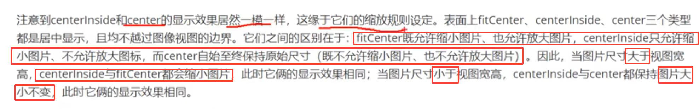

==直接在xml文件中用onclick方法,这会造成高耦合,所以用下面的方法==

#点击事件和长点击事件

# Ctrl + alt +f 把变量设置为全局变量

#禁用和恢复按钮

==空指针异常解决办法==：把Oncreate中你要传到下面onclick的那个组件，前面的类类型去掉，否则它会被识别为一个局部变量而导致null point

#图像视图

#

==imageview默认是 fitcenter==

==既可以在xml中也可以在java文件中设置==

# 图像按钮

## 同时展示文本和图像

