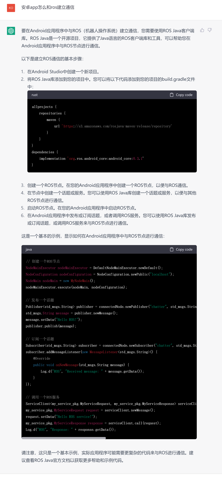

```
allprojects {
    repositories {
        maven {
            url 'https://s3.amazonaws.com/rosjava-maven-release/repository'
        }
    }
}
dependencies {
    implementation 'org.ros.android_core:android_core:0.3.1'
}

// 创建一个ROS节点
NodeMainExecutor nodeMainExecutor = DefaultNodeMainExecutor.newDefault();
NodeConfiguration nodeConfiguration = NodeConfiguration.newPublic("localhost");
NodeMain nodeMain = new MyNodeMain();
nodeMainExecutor.execute(nodeMain, nodeConfiguration);

// 发布一个话题
Publisher<std_msgs.String> publisher = connectedNode.newPublisher("chatter", std_msgs.String._TYPE);
std_msgs.String message = publisher.newMessage();
message.setData("Hello ROS!");
publisher.publish(message);

// 订阅一个话题
Subscriber<std_msgs.String> subscriber = connectedNode.newSubscriber("chatter", std_msgs.String._TYPE);
subscriber.addMessageListener(new MessageListener<std_msgs.String>() {
    @Override
    public void onNewMessage(std_msgs.String message) {
        Log.d("ROS", "Received message: " + message.getData());
    }
});

// 调用一个ROS服务
ServiceClient<my_service_pkg.MyServiceRequest, my_service_pkg.MyServiceResponse> serviceClient = connectedNode.newServiceClient("my_service_pkg/my_service", my_service_pkg.MyService._TYPE);
my_service_pkg.MyServiceRequest request = serviceClient.newMessage();
request.setData("Hello ROS service!");
my_service_pkg.MyServiceResponse response = serviceClient.call(request);
Log.d("ROS", "Response: " + response.getData());

```

