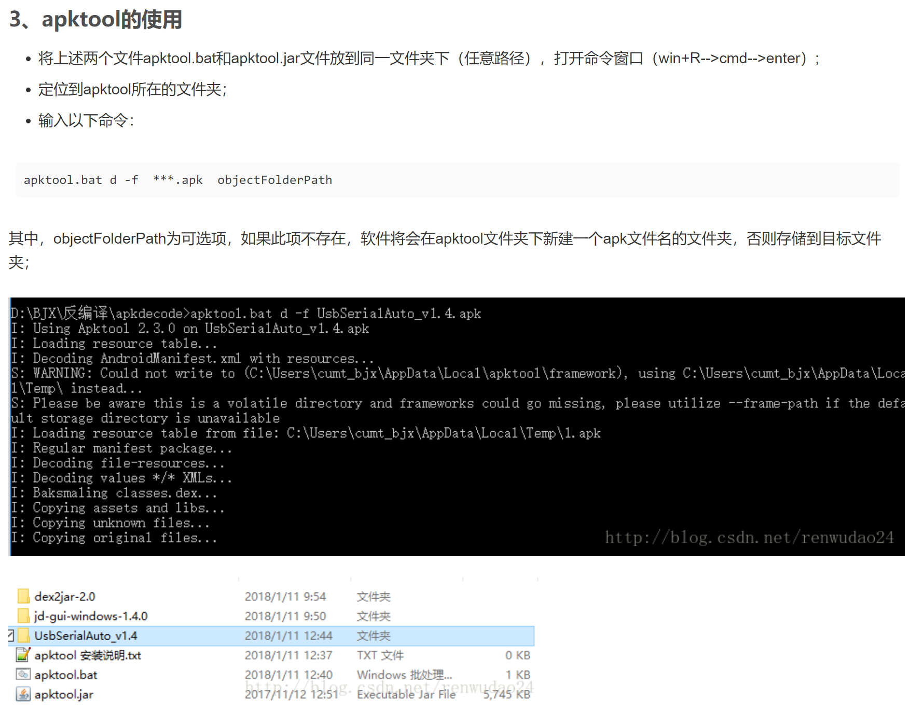

# apktool

[apktool安装包](https://bitbucket.org/iBotPeaches/apktool/downloads/?tab=downloads)

[apktool主页(安装包和安装说明)](https://ibotpeaches.github.io/Apktool/)

### 新建文本文件，将下面的脚本复制到文本并保存，然后重命名为apktool.bat;

```
@echo off
if "%PATH_BASE%" == "" set PATH_BASE=%PATH%
set PATH=%CD%;%PATH_BASE%;
chcp 65001 2>nul >nul
java -jar -Duser.language=en -Dfile.encoding=UTF8 "%~dp0\apktool.jar" %*
```

### 从上面脚本中也可以看到是用apktool.jar文件去处理；

###  将下载的apktool_2.3.1.jar文件重命名为apktool.jar；



```
apktool.bat d -f  ***.apk  objectFolderPath  
```

